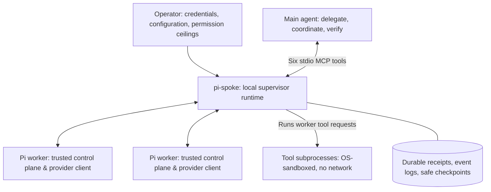

# pi-spoke

**Give your main agent a team. Keep it in charge.**

pi-spoke connects a main agent to independent Pi workers through a local Model Context Protocol (MCP) server. Delegate an investigation, get another model’s perspective, or hand off a scoped edit while the main agent keeps working. Each worker gets a self-contained task; the main agent verifies the result and brings it back into the larger objective.

**Status:** Unpublished **0.1.0**. Release gates passed for the pinned macOS 15.6 arm64 host and pinned Linux arm64 OrbStack VM. See [platform qualification and limits](#platform-qualification-and-limits) before use.

[Quick start](#quick-start) · [Use the skill](#use-the-pi-spoke-skill) · [The six tools](#the-six-tools) · [Operations guide](docs/operations.md) · [Compatibility ledger](docs/compatibility.md) · [Documentation index](docs/README.md)

---

## Why pi-spoke?

- **Explicit model selection:** Discover available providers and models dynamically. Choose the exact model for each task with no silent substitution.
- **Non-blocking delegation:** Spawning a worker returns a durable receipt with `state: "starting"`. The main agent stays free to continue host work; bounded observation waits (up to 25 seconds) do not cancel worker execution.
- **Persistent sessions:** Sessions preserve conversation context across runs. Work can be resumed from validated safe checkpoints (subject to native Pi context compaction).
- **Structured worker contact:** Workers can send notes, ask questions, or propose improvements. The main agent replies directly to correlated `question_id`s.
- **Scoped capability ceilings:** Grant read/search tools, optional skill metadata, and independent file-write roots. Shell execution and file-mutation permissions are decoupled.
- **Duplicate suppression & crash safety:** Request keys suppress duplicate identical accepted requests. Uncertain or interrupted work is never automatically replayed.

---

## How it fits together



The **operator** configures credentials and capability ceilings. The **main agent** owns orchestration and synthesis. Each **worker** owns its local method within its assigned task and tool grant.

---

## Quick start

### Guided installation

From this source checkout, run:

```sh
bash install.sh
```

The interactive installer checks prerequisites, offers a private Node 24.15.0
installation, copies and builds pi-spoke outside worker workspaces, and walks
through provider credentials, model selection, permissions, and limits. It can
reuse an existing installation and Pi files. New setups use read/search tools
with no write grants; credentials are entered with hidden input.

Review the generated files before saving. Existing operator configuration and
connection snippets receive private backups; existing provider files are reused
without modification. Sandbox canaries and a six-tool MCP handshake are offered
before optional Codex registration. No provider inference is run.

The root script also supports downloaded or piped invocation by fetching the
source from GitHub (`PI_SPOKE_REF` selects a branch, tag, or commit). That mode
requires these installer files to be published at the selected ref; until then,
run the checkout command above. See the [installer guide](docs/setup.md) for
prerequisites, reruns, and verification limits.

### 1. Build from source

Requires **Node 24.15.0** and the locked dependencies. On the qualified Linux VM, install `bubblewrap`, `socat`, `ripgrep`, and `build-essential` first (the build compiles a native seccomp filter with `/usr/bin/cc`).

```sh
npm ci --ignore-scripts
npm run build
```

### 2. Create an operator configuration

Copy [examples/read-only.json](examples/read-only.json) to a private location outside worker workspaces and set your absolute paths. Workspace directories must already exist. Keep the Pi Spoke installation, configuration, credentials, state, and scratch outside worker workspaces. Configure your operator-owned Pi authentication file and optional models file, and keep scratch paths short enough for the sandbox’s Unix socket names.

Plain `doctor` checks configuration and host readiness without inference. The explicit `--sandbox-check` runs disposable sandbox canaries:

```sh
node dist/cli.js doctor --config /absolute/path/to/pi-spoke.json --instance project-a
node dist/cli.js doctor --config /absolute/path/to/pi-spoke.json --instance project-a --sandbox-check
```

### 3. Connect to your MCP host

Launch the stdio server:

```sh
node dist/cli.js serve --config /absolute/path/to/pi-spoke.json --instance project-a
```

For OpenAI Codex, adapt [examples/codex.toml](examples/codex.toml) to your absolute binary and configuration paths.

---

## Use the Pi Spoke skill

You can teach your host agent how to coordinate pi-spoke workers by installing the provided main-agent skill. Copy or symlink the entire [skills/pi-spoke](skills/pi-spoke) directory (including its [references](skills/pi-spoke/references/tool-guide.md)) into your host agent's skills directory.

Replace both placeholder paths below; the destination host skills directory must already exist.

```sh
# Example: link the skill directory into your host's skills folder
ln -s /absolute/path/to/pi-spoke/skills/pi-spoke /path/to/host/skills/pi-spoke
```

### Main-agent orchestration

The skill guides your orchestrating agent on using the six MCP tools, constructing self-contained tasks, handling worker questions, and managing safe continuations. Using the skill requires a configured, working pi-spoke MCP connection; it does not configure credentials, start the supervisor, or force automatic delegation. The main agent retains full responsibility for deciding whether to delegate, coordinating active runs, verifying evidence, and integrating results.

Once installed and connected, you can prompt your host agent with natural language:

> Use the Pi Spoke skill to review the configuration module. Choose a configured Gemini model, grant read/search tools, observe the worker, and summarize any edge cases. Do not edit files.

When choosing models, catalog `description` fields provide operator guidance on intended task suitability (see [model descriptions](skills/pi-spoke/references/tool-guide.md#model-descriptions)), but catalog entries do not prove live provider entitlement or quota.

### Host skill vs. worker suggested skills

The two kinds of skill serve different agents:

- **Main-agent skill:** The host-level [SKILL.md](skills/pi-spoke/SKILL.md) instructions that guide the main agent on tool syntax, observation loops, and failure recovery.
- **Worker suggested skills:** Optional domain skills made available to delegated workers via operator `skill_roots`, or `.agents/skills` under the workspace root when `project_skills: true` is enabled in the [operator configuration](docs/operations.md). Both discovery sources are disabled by default.

To suggest expertise to a worker:

1. Discover available skill IDs for a workspace using `spoke_catalog` with `kind: "skills"` and `cwd`.
2. Pass `skill_id` values marked `available_for_model_invocation: true` in `suggested_skills` when calling `spoke_spawn` or `spoke_send` (continue), and ensure the worker has a granted reader (such as `read`).
3. Workers receive initial metadata and file locations, then independently choose whether to read and use the instructions.
4. Suggested skills never expand worker file-write authority or execution permissions (see [ADR 0007](docs/adr/0007-explicit-resources-and-optional-skills.md)).

---

## The six tools

| Tool | Purpose | Key parameters |
|---|---|---|
| `spoke_catalog` | Discover models, skills, and tools with zero inference cost. | `kind`: `"models"` \| `"skills"` \| `"tools"`, optional `query`, `cursor`, `limit` |
| `spoke_spawn` | Start an independent worker run and receive an accepted receipt. | `request_key`, `task`, `cwd`, `model`, `tools`, `permissions`, `limits` |
| `spoke_observe` | Check status, read events, or fetch paged output (wait up to 25s). | `run_id`, `view`: `"summary"` \| `"events"` \| `"output"`, `after_seq`, `wait_ms` |
| `spoke_send` | Steer a run, answer a worker question, or continue a saved session. | `kind`: `"steer"` \| `"reply"` \| `"continue"`, `request_key`, `message` |
| `spoke_cancel` | Stop a running worker without deleting checkpoints or state. | `run_id`, optional `reason` |
| `spoke_sessions` | List saved sessions and evaluate continuation eligibility. | Optional `cwd`, `cursor`, `limit` |

---

## Delegation example

1. **Discover models:** Call `spoke_catalog` with `{"kind": "models"}` to list configured model references.
2. **Spawn a worker:** Call `spoke_spawn` with an explicit model, read tools, and a self-contained task:

```json
{
  "request_key": "audit-config-001",
  "task": "Review src/config.ts and its error handling. Identify unhandled edge cases and cite lines. Do not edit files.",
  "cwd": "/absolute/path/to/workspace",
  "model": {
    "provider": "configured-provider",
    "id": "model-id-from-catalog"
  },
  "tools": ["read", "grep", "find", "ls"],
  "project_context": "agents",
  "permissions": {
    "file_write_roots": [],
    "shell_write_roots": []
  }
}
```

The server returns an accepted receipt with `state: "starting"` and `run_id` and `session_id` values. Reuse a request key only for an identical request.

3. **Observe execution:** Poll `spoke_observe` with `view: "summary"` and `wait_ms: 15000` while continuing independent work.
4. **Answer questions:** If the worker contacts the host with a question, reply via `spoke_send` using `kind: "reply"` and the exact `question_id`.
5. **Continue conversation:** When a run has a validated safe checkpoint and eligible cleanup, continue the session using `spoke_send` with `kind: "continue"`, `session_id`, and `expected_last_run_id`.

---

## Platform qualification and limits

- **Qualified hosts:** Release gates have passed only for macOS 15.6 (Darwin 24.6.0, arm64) and Ubuntu 24.04.5 in an OrbStack arm64 VM. Native Linux Codex is not qualified (verification used a macOS Codex host connected to Linux workers). Qualification is tied to the exact host, kernel, and toolchain identities in the [compatibility ledger](docs/compatibility.md); different identities fail closed for tool execution until requalified.
- **Trust boundary & sandboxing:** Tool subprocesses run inside mandatory OS sandboxes (Seatbelt on macOS, bubblewrap and seccomp on Linux) with tool networking strictly denied. The supervisor, Pi runtime, and provider client are trusted control-plane components; permitted context and file excerpts can leave the machine in provider inference requests.
- **Shell execution:** Project shell-write policies are unsupported (`SANDBOX_POLICY_UNSUPPORTED`). Without project write grants, `bash` has private writable scratch while project source remains read-only. Arbitrary-shell runs end interrupted with unconfirmed descendant cleanup.
- **File writes:** Structured file modifications require explicit `file_write_roots`. Authorized edits are applied without automatic rollback on run failure or cancellation.
- **Recovery:** Uncertain cleanup requires independent operator inspection before using `recover --acknowledge-cleanup`. pi-spoke never automatically replays ambiguous work.

---

## Verification

```sh
npm run verify        # Typecheck, unit, contract, integration, and sandbox test suites
npm run release:check  # Audit evidence ledger against qualification gates
```

`verify` also builds the project and uses disposable fixtures with no live provider. Sandbox tests need a host that permits sandbox initialization; Linux fixtures require a writable `/private/tmp`. Live provider tests are explicitly opt-in.

`release:check` audits recorded evidence, not the current machine’s binary identities. Select another ledger with `-- --platform linux` or `-- --platform darwin`. No package or release has been published.

---

## Documentation

- [Main-agent skill](skills/pi-spoke/SKILL.md) · [Tool guide and model descriptions](skills/pi-spoke/references/tool-guide.md)
- [Context glossary](CONTEXT.md)
- [Operations & recovery runbook](docs/operations.md)
- [Compatibility & evidence ledger](docs/compatibility.md)
- [Safety & sandbox specification](docs/SAFETY_SPEC.md)
- [Architecture decisions (ADRs)](docs/adr/README.md)
- [Documentation index](docs/README.md)
